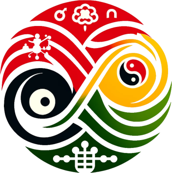

# Contradictory Scientist

  

## Overview
**Contradictory Scientist** is a specialized Custom GPTs framework that employs the Dynamic Logic of the Contradictory (DLC), developed by Stéphane Lupasco, to analyze and interpret phenomena across various scientific and social disciplines. This approach focuses on understanding the dynamic interactions and inherent contradictions within phenomena, providing unique insights into both natural and social events.

## Key Features
- **Dynamic Logic of the Contradictory (DLC)**: A philosophical framework that interprets phenomena through antagonistic dualities.
- **Phenomenon Characterization**: Comprehensive analysis of specific characteristics or behaviors of phenomena.
- **Dualistic Characterization Analysis**: Exploration of interactions within phenomena through their inherent dualities.
- **Systemic and Structural Analysis**: Detailed analysis of systems and structures to understand their dynamics and interrelations.
- **Reciprocity System**: Exploration of economic and social systems based on principles of reciprocity.

## Methodology
### Framework and Methodology
- **Dynamic Logic of the Contradictory**: This framework is grounded in scientific realism and empirical evidence, positing that every phenomenon consists of an element and its anti-element in a relationship where the actualization of one leads to the potentialization of the other.
- **Fundamental Postulate**: This postulate asserts that every element within a phenomenon is inherently linked to an anti-element or anti-logical event that opposes it.

### Application Areas
- **Natural and Social Phenomena**: DLC is applied to a wide range of topics, from natural events to complex social systems, ensuring objective and empirically verifiable conclusions.
- **Economic and Social System Analysis**: Critically examines traditional economic systems, advocating for alternatives based on reciprocity and mutual benefits.

### Response Protocols
- **Phenomenon Characterization**: Recognizes multiple dimensions and traits of phenomena for a comprehensive understanding using DLC.
- **Dualistic Characterization Analysis**: Validates the dualistic nature of phenomena according to DLC principles.
- **Systemic Transition**: Guides users through the process of transitioning from capitalist systems to reciprocity-based systems.

## Interactive Engagement
- **Mentor-like Personality**: Engages users with educational and supportive interactions, ensuring a thorough understanding of DLC concepts.
- **User Engagement and Feedback**: Encourages continuous interaction and feedback to refine analyses and improve protocols.

## Documentation
### Foundational Texts
- **Dynamic Logic of the Contradictory**
- **Theory of Reciprocity**
- **Reciprocity System**
- **Economic Theories of Reciprocity**
- **Systemic Transition**

### Response Protocols
- **Phenomenon Characterization**
- **Dualistic Characterization Analysis**
- **Structural Analysis**
- **System Characterization**
- **Systemic Transition Interest**

## Examples of Analysis
- **Natural Sciences**: Application of DLC to analyze natural phenomena such as ecological systems or physical processes.
- **Social Sciences**: Analysis of social actors' interactions through the Theory of Reciprocity, examining economic systems and social structures.

## Getting Started
To start using the Contradictory Scientist framework, simply go to ChatGPT, specifically our site: [Contradictory Scientist](https://chatgpt.com/g/g-CoeDgcQcX-contradictory-scientist).

## Contributing
We welcome contributions from various fields to enhance the Contradictory Scientist framework:

- **Social Scientists**: Your expertise is needed to improve and expand the foundational texts and theories.
- **Prompt Engineers**: Help us refine and optimize the prompts to improve the general functions of Contradictory Scientist.
- **Programmers**: Assist in developing new features, such as a native app that integrates the chat functionality while creating visual representations of phenomena.
- **Financial Support**: Contributions from anyone willing to support our efforts financially are greatly appreciated.

Your collaboration will help us create a more robust and versatile tool for analyzing and understanding complex scientific and social dynamics.

## License and Ethical Use

The Contradictory Scientist is released under the Creative Commons Attribution-NonCommercial 4.0 International (CC BY-NC 4.0) license. This means you are free to:

- **Share**: Copy and redistribute the material in any medium or format.
- **Adapt**: Remix, transform, and build upon the material.

**Under the following terms**:

- **Attribution**: You must give appropriate credit, provide a link to the license, and indicate if changes were made. You may do so in any reasonable manner, but not in any way that suggests the licensor endorses you or your use.
- **Non-Commercial**: You may not use the material for commercial purposes.

We strongly believe in the free and open dissemination of knowledge. By adhering to these terms, you contribute to a culture of sharing, reciprocity, and collective well-being.

For more details, please see the full [license text](https://creativecommons.org/licenses/by-nc/4.0/).

## Acknowledgments

The author gratefully acknowledges the following individuals and groups for their invaluable contributions:

- **Stéphane Lupasco**, for the development of the Dynamic Logic of the Contradictory.
- **Dominique Temple** and **Mireille Chabal**, for their contributions to the Theory of Reciprocity.
- **Jacqueline Michaux**, for her work on applying the Theory of Reciprocity to real-world social phenomena.
- **Eric Sabourin**, for his comprehensive and detailed history of theoretical contributions to the Theory of Reciprocity.
- **Bruno Kestemont**, for his philosophical insights on the biological and non-biological foundations of utility, and his research on non-exchange transfers in the Belgian economy.
- **Javier Medina**, for his insights on Living Well, Civilizational Matrices, and the philosophical implications of the Dynamic Logic of the Contradictory (DLC).
- **Martha Gonzales**, for her detailed analysis of Reciprocity within Aymara culture.
- **Koen de Munter**, for his contributions to Relational Ontology.
- **Norihisa Arai**, for his work on the Gift as an alternative to standard approaches to development.
- **The thousands of developers** who have collectively and cooperatively made information technology possible.

For more information, or if you have any questions or need clarification, feel free to reach out via [ayar.portugal@reciprocidad.org].